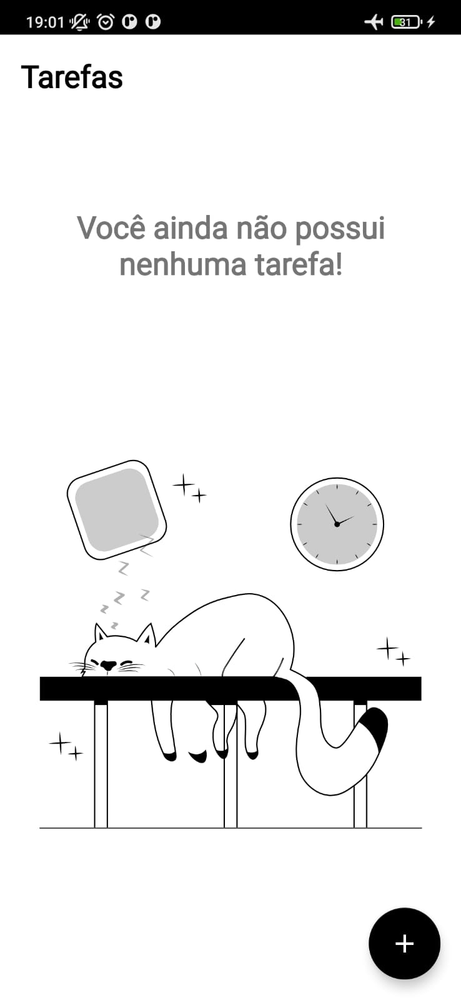

# To Do List
---
### Projeto final do Santander Mobile Bootcamp
O objetivo do projeto é criar um App de To do list, e evoluir a aplicação de forma a entregar melhores e mais robustas soluções, com o objetivo de praticar o conteúdo visto no bootcampe incentivar a busca de novos conhecimentos.

---
### Sobre o App:
O aplicativo em si possui uma premissa muito simples, criar e listar tarefas, atualmente, com capacidade de armazenar título, data e hora. Possui duas telas simples, uma para listagem e outra para criação. Contudo, essa simplicidade abre a possibiliadade para implementação de inúmeras melhorias.

