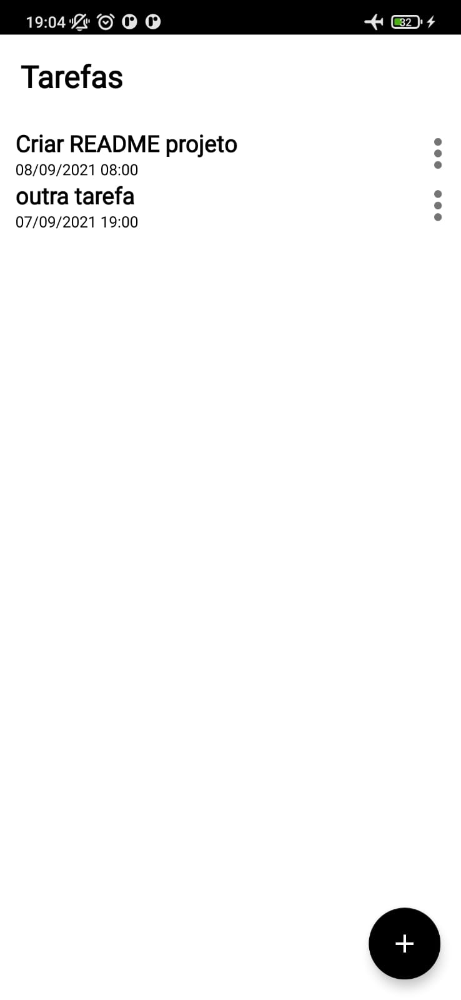

# To Do List

---

### Projeto final do Santander Mobile Bootcamp

O objetivo do projeto é criar um App de To do list, e evoluir a aplicação de forma a entregar melhores e mais robustas soluções, com o objetivo de praticar o conteúdo visto no bootcampe incentivar a busca de novos conhecimentos.

### Sobre o App:

O aplicativo em si possui uma premissa muito simples, criar e listar tarefas, atualmente, com capacidade de armazenar título, data e hora. Possui duas telas simples, uma para listagem e outra para criação. Contudo, essa simplicidade abre a possibiliadade para implementação de inúmeras melhorias. Veja as [screenshots](#screenshots) do projeto até agora!

---

### Possíveis Features e Melhorias

- [x] Organização da estrutura do código.
- [ ] Implementar a arquitetura MVVM e práticas de Clean Architecture.
  - [x] MVVM
- [ ] Criar campo de descrição das tarefas.
- [ ] Criar view para visualização detalhada de uma tarefa.
- [x] Implementar persistência dos dados com SQLite/Room. [Veja os desafios!](#implementação-da-room)
- [ ] Implementar TAGs personalizadas para tarefas.
- [ ] Trocar label do botão de editar uma tarefa ("Criar tarefa" -> "Salvar" ou "Editar").
- [ ] Ordenação de tarefas por data e hora ou até mesmo prioridade

---

# Desafios enfrentados / Bugs

- [x] Na criação da Recycler view os labels dos itens não apareciam. Resolvido: através do fluxo de dados da aplicação foi possível identificar que eu havia me esquecido de executar a função bind do ViewHolder dentro da função onBindViewHolder do adapter.
- [ ] O botão de retorno da toolbar da activity de criação de tarefas não funciona.
- [ ] A funcionalidade de editar tarefas não funciona corretamente: o data store gerencia e retorna corretamente os dados, que são carregados corretamente na função submitList do adapter.
- [x] Após implementação da Room, a lista da RecyclerView não atualizava.

# Implementação da Room

Na implementação do banco de dados no app me deparei com vários desafios:

- Pouco conhecimento em banco de dados relacionais, tive muitas dúvidas ao realizar operações no banco de dados, por exemplo, verificar se a tabela estava vazia.
- Mostrar a imagem de fundo que representa que o usuário não possui nenhuma tarefa, ou seja a tabela estava vazia, me deparei tanto com o problema anterior, quanto com o pouco conhecimento em coroutines do Kotlin.
- Decidir a melhor forma de retornar os dados, pela falta de conhecimento em Kotlin coroutines travei na integração da ViewModel com o repositório, pois não sabia se usava os dados na sua forma bruta ou se usava o Flow com LiveData, no fim a segunda opção pareceu mais limpa.
- Reutilizar a funcionalidade da base do projeto para editar uma Tarefa, no fim implementei uma função lambda para utilizar um observer do LiveData.
- Devido ao uso de um equal() e hashCode() customizados o Observer da lista retornada para a recycler view não considerava a edição e não atualizava a lista. Optei por usar a implementação padrão dessas funções.

---

# Screenshots

